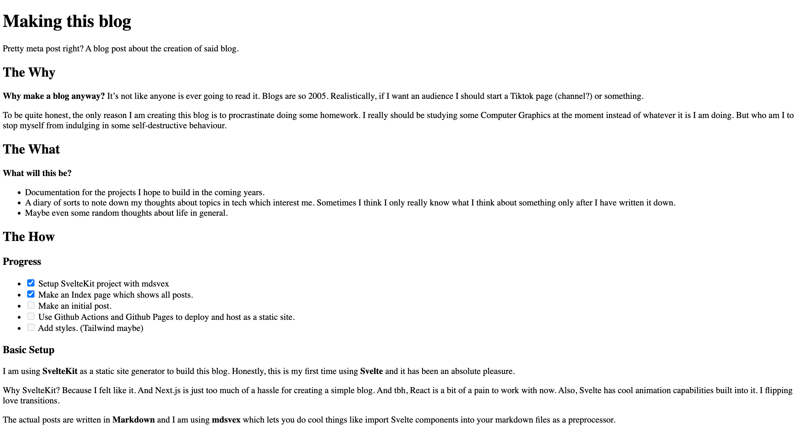

# {title}

Pretty meta post right? A blog post about the creation of said blog. 

## The Why

**Why make a blog anyway?** It's not like anyone is ever going to read it. Blogs are so 2005. Realistically, if I want an audience I should start a Tiktok page (channel?) or something.

To be quite honest, the only reason I am creating this blog is to procrastinate doing some homework. I really should be studying some Computer Graphics at the moment instead of whatever it is I am doing. But who am I to stop myself from indulging in some self-destructive behaviour. 

## The What

**What will this be?**

- Documentation for the projects I hope to build in the coming years.
- A diary of sorts to note down my thoughts about topics in tech which interest me. Sometimes I think I only really know what I think about something only after I have written it down.
- Maybe even some random thoughts about life in general.

## The How

### Progress

- <input type="checkbox" checked/> Setup SvelteKit project with mdsvex
- <input type="checkbox" checked/> Make an Index page which shows all posts.
- <input type="checkbox" checked> Make an initial post.
- <input type="checkbox" disabled> Add styles. (Tailwind maybe)
- <input type="checkbox" disabled> Use Github Actions and Github Pages to deploy and host as a static site.

### Basic Setup

I am using **SvelteKit** as a static site generator to build this blog. Honestly, this is my first time using **Svelte** and it has been an absolute pleasure.  

Why SvelteKit? Because I felt like it. And Next.js is just too much of a hassle for creating a simple blog. And tbh, React is a bit of a pain to work with now. Also, Svelte has cool animation capabilities built into it. I flipping love transitions.

The actual posts are written in **Markdown** and I am using **mdsvex** which lets you do cool things like import Svelte components into your markdown files as a preprocessor.

The plan is to use Github Actions to build the site everytime I push a change and then host it on Github Pages. What can I say I am team Octocat all the way.

## Styling

### Tech Stack
- Svelte
- SvelteKit
- mdsvex

